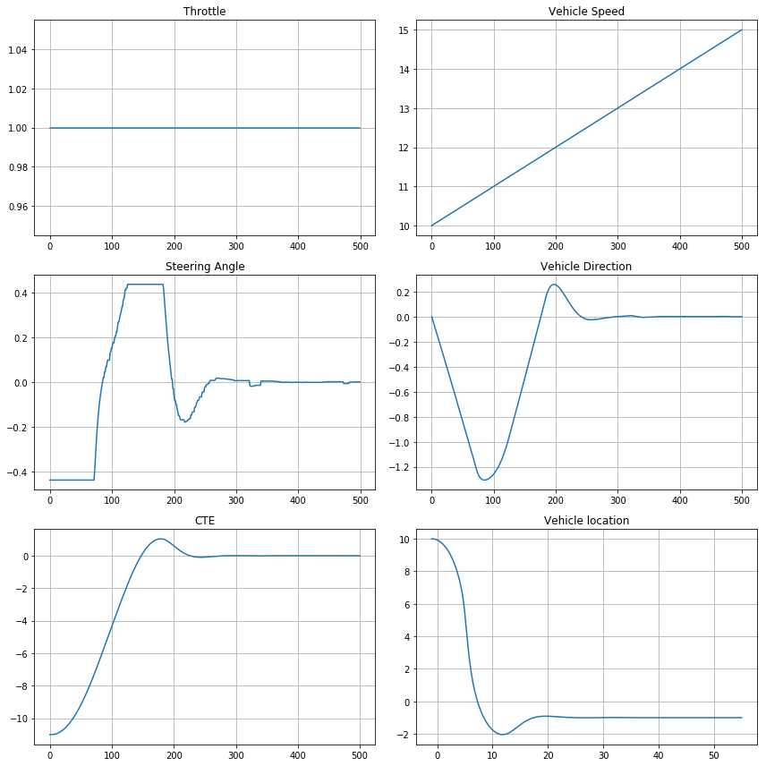
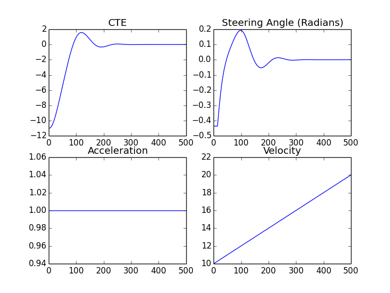

# Model Predictive Control

Model Predictive Control is an important tool in self-driving cars. It is used to force the vehicle to follow a given trajectory generated by the path planning module. In this project, I wrote a simple [MPC class in Python & TensorFlow](./model_predictive_control_in_tensorflow.ipynb) based on the C++ implementation provided in [Udacity's self-driving car nano-degree program](./src/MPC.cpp).

The following plots show the results from the Python/TensorFlow and C++/IPOPT implementations, respectively.

## [Python and TensorFlow Optimal Control Results](./model_predictive_control_in_tensorflow.ipynb):

  

## [C++ and Eigen/Ipopt Optimal Control Results](./src/MPC.cpp):

  
  
